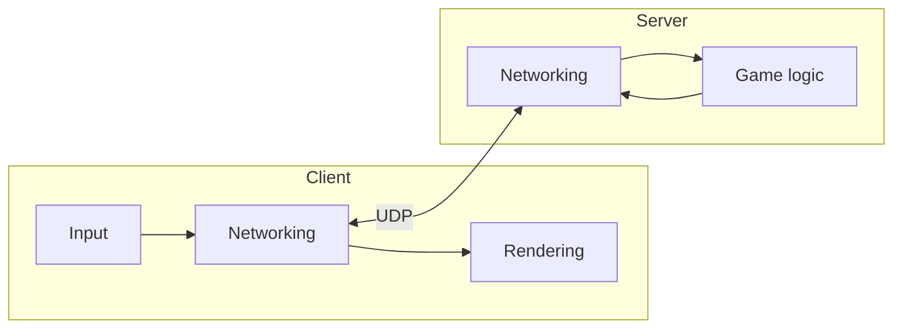

# Architecture

> TODO: fill in once the architecture is decided. Keep it high level: subsystems and how they
> interact, not every class.

## Subsystems

### Networking

### Game logic

### Rendering
