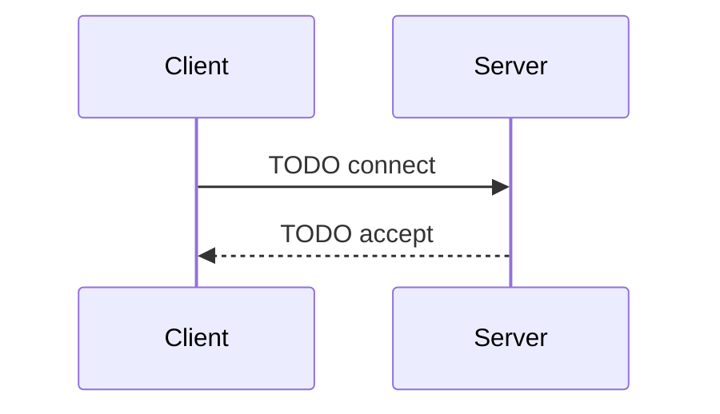

# R-Type network protocol

> Written so that someone could implement a new client from this document alone.

## 1. Overview

- Transport: UDP
- Byte order: TODO
- Versioning: TODO

## 2. Packet header

| Offset | Size | Field | Description |
|--------|------|-------|-------------|
|        |      |       |             |

## 3. Messages

### 3.1 Client → Server

### 3.2 Server → Client

## 4. Connection lifecycle

## 5. Error handling

How malformed, truncated or oversized packets are handled.
